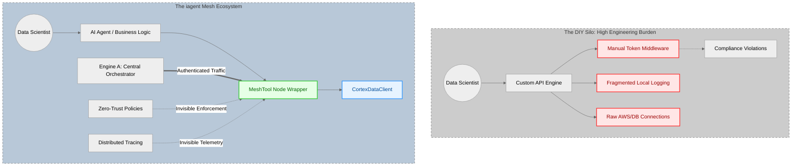
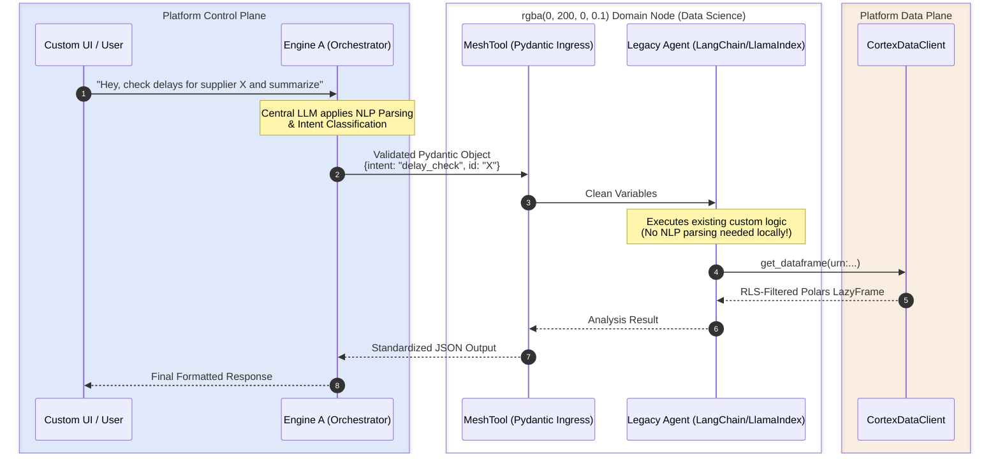
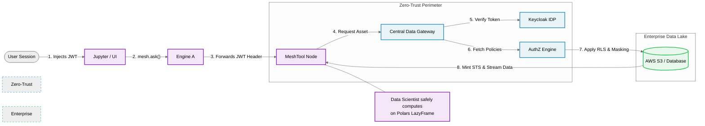

# THE iagent MESH: LAUNCH DOMAIN NODES, NOT SCRIPTS
### An Architectural Guide for Data Science and AI Engineering Teams

Your team’s primary directive is to engineer state-of-the-art AI agents and custom user experiences. However, the path to production often forces data scientists to become part-time cloud infrastructure engineers. In an enterprise environment, AI cannot operate in the shadows; agents must be assigned to persons, and their actions must be entirely traceable, predictable, observable, grounded, and trustworthy. 

This document outlines the architectural realities of deploying AI services in our enterprise ecosystem, comparing the traditional Do-It-Yourself (DIY) API deployment against adopting the native `MeshTool` framework.

---

## PART 1: THE DIY REALITY (THE HIDDEN COST OF CUSTOM INFRASTRUCTURE)

If you choose to bypass the framework and deploy your agents as standalone APIs (e.g., raw FastAPI/Flask) to serve your custom UIs, you assume full responsibility for the enterprise plumbing. 

Here is the infrastructure you are now required to build, maintain, and secure to meet enterprise standards:

* **Identity & Policy Enforcement:** Enterprise agents must be definitively assigned to real persons. You must manually write middleware to intercept Keycloak JWTs, parse claims, and enforce complex data access policies on every single incoming request to prove authorization.
* **Data Access & Grounding:** To be trustworthy, an agent must be firmly grounded in secure enterprise data. You cannot simply ask for a dataset; you must manage your own AWS STS token exchanges, handle credential rotation, and manually enforce Row-Level Security (RLS) and column masking to remain compliant.
* **Distributed Tracing (The Black Hole):** An AI system must be completely observable. When your custom UI calls your agent, and your agent calls a vector DB or an LLM, the trace is easily broken. You must manually inject Langfuse observers, pass trace IDs through your thread pools, and manage the `contextvars` yourself. When a hallucination or failure occurs, your logging is siloed and untraceable.
* **Concurrency & Predictability:** AI behavior must be predictable. If your agent uses `asyncio` mixed with synchronous data crunching (Pandas/Polars) or nested sub-agents (`smolagents`), you risk freezing your event loop and crashing your Kubernetes pods under load unless you manually patch and manage thread pools.
* **Deployment Boilerplate:** You own the Dockerfiles, the Kubernetes YAMLs, the Helm charts, and the CI/CD pipeline definitions required to get your code into the cluster.

**The Result:** Your team spends 80% of its velocity maintaining backend plumbing and proving compliance, and only 20% engineering the actual AI and the custom UI.

---

## PART 2: THE `MeshTool` ADVANTAGE

The `MeshTool` framework is not a restriction; it is an exoskeleton. It provides a hardened, headless backend for your custom UI, absorbing all enterprise infrastructure and compliance complexity into three lines of code.

### 1. Frictionless, Trustworthy Data Plane
Never manage an AWS key, database password, or access policy again.
* **Identity Passthrough:** Agents are inherently assigned to persons. The moment you use `CortexDataClient()`, the mesh invisibly routes your user's Keycloak JWT through the cluster, ensuring every action is tied to a verified human.
* **Native Compliance & Grounding:** The platform automatically enforces central data access policies, RLS, and column masking before the data ever hits your agent. Your agent is guaranteed to be grounded in trustworthy, authorized enterprise data.
* **High-Throughput Ready:** Seamless integration with `dag_tools` returns Polars LazyFrames for instant, massive-scale data crunching without crashing your LLM context windows.

### 2. Complete Observability Out-of-the-Box
Debugging a nested AI loop shouldn't require guesswork. 
* **End-to-End Traceability:** The mesh generates a unified Trace ID from your custom UI's HTTP header and propagates it flawlessly across all network boundaries and asynchronous threads.
* **Langfuse Native:** Every LLM call, tool use, and latency spike inside your agent is automatically tracked, made fully observable, and tied to the exact user session.

### 3. Predictable Concurrency & DevOps
You write the Python; the platform ensures predictable execution.
* **Safe Asynchronous Execution:** The framework natively applies `nest_asyncio` and thread-pool routing. You can spin up heavy data operations or nested agent loops without ever freezing your API.
* **One-Click Deployment:** Use the interactive `scaffold.sh` to generate a GitOps-ready repository. Push your code, and Jenkins automatically builds the container (via S2I) and deploys it. Zero Dockerfiles required.

### 4. Headless Architecture (Bring Your Own UI)
We do not force you into a centralized UI.
* **Perfect Portability:** `MeshTool` exposes standard, OpenAPI-compliant endpoints. Your custom React, Vue, or Streamlit frontend can communicate with your agent exactly as it does today.
* **Global Discoverability:** While you power your custom UI, the framework automatically registers your agent's OpenAPI schema to the DataHub Universal Registry. Engine A (the central mesh) can now discover and route relevant enterprise traffic to your endpoint, giving your domain expertise massive internal distribution for free.

---

## PART 3: SYSTEMS ARCHITECTURE (DoDAF VIEWS)

### The OV-1: Operational Concept Graphic
This diagram contrasts the high engineering burden of the DIY approach against the streamlined elegance of the Mesh ecosystem.

### The SV-1: Systems Interface Description
How existing legacy architectures (LangChain/LlamaIndex) interface securely with the central orchestrator via structured passthrough.

### The SV-4: Systems Functionality / Data Security Flow
The invisible path of identity propagation ensuring every computation is grounded in verifiable enterprise access controls.

---

## THE VERDICT

If you build your own orchestrator and API from scratch, you own the burden of distributed tracing, token rotation, data access policy enforcement, and proving your agents are trustworthy. 

If you wrap your logic in `@app.execute()`, the Mesh handles 100% of the enterprise plumbing, ensuring your agents are traceable, predictable, observable, and grounded by default. 

**Focus your talent on building superior agents and exceptional custom UIs. Let the Mesh handle the infrastructure.**
